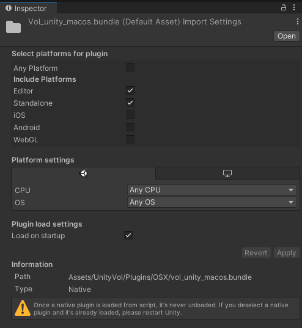

# Unity Plugin 

This repo contains the projects to build the native Volograms player plugins for Unity. It also uses code taken from [this repository](https://bitbucket.org/volograms/vol_av/src/master/). Each platform has a separate project and each project contains a README that documents how to build their respective plugin. When a plugin is built, it is copied to the `UnityVol` folder, which can be dragged and dropped into Unity. 

## Platform Avaialble 
- Mac (OSX)
- iOS

## TODO Platforms 
- Windows
- Android
- Linux

## Getting started
Clone the repository and follow the README for each platform that you want to build for. In your Unity project, drag and drop the `UnityVol` folder into the Project pane. Inside the `c-sharp-example` folder you will find an example of a C# bridging script that will give you access to the functions within the plugins. See [Unity's documentation on Native plugins for more details](https://docs.unity3d.com/Manual/NativePlugins.html).

## Unity Settings
After importing the plugin into Unity, ensure that the Unity settings for each plugin is correct. For example, we don't want to the iOS plugin in a Mac build

### iOS Settings

### Mac Settings

## Unity Build 
After importing the plugin into Unity and building your project for iOS, the Xcode build may fail due to `undefined symbols` error. This is because some of the frameworks that are required by the iOS plugin are not included in a Unity-Xcode project by default. Specifically, these frameworks/libs may be missing:

* `libbz2.tbd`
* `libz.tbd`
* `VideoToolbox.framework`

These can be added by going to the `Build Phases` of the Unity-Xcode project by:

* Selecting the `Unity-iPhone` project in the Navigator 
* Selecting the `UnityFramework` target 
* Selecting `Build Phases` in the toolbar
* Expand `Link Binary With Libraries`

Then click the `+` button and searching for the above frameworks and libs by name

